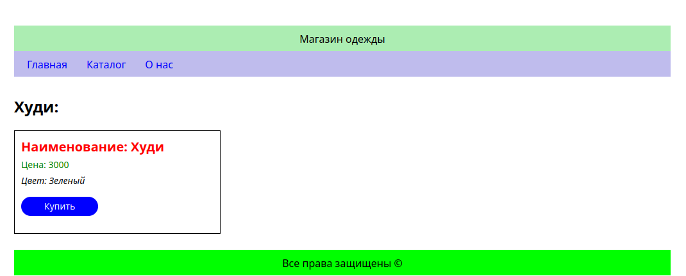

# Фреймворки Flask и FastAPI (семинары)
## Урок 1. Знакомство с Flask 

### Задание 1

Создать базовый шаблон для интернет-магазина, содержащий общие элементы дизайна (шапка, меню, подвал), и дочерние шаблоны для страниц категорий товаров и отдельных товаров. Например, создать страницы «Одежда», «Обувь» и «Куртка», используя базовый шаблон.

### Решение
**Задание 1**

### Результат работы:

Результат находится в файле mian.py

#### Главная страница

#### Страница "О нас"

#### Страница "Каталог товаров"

#### Страница товара

